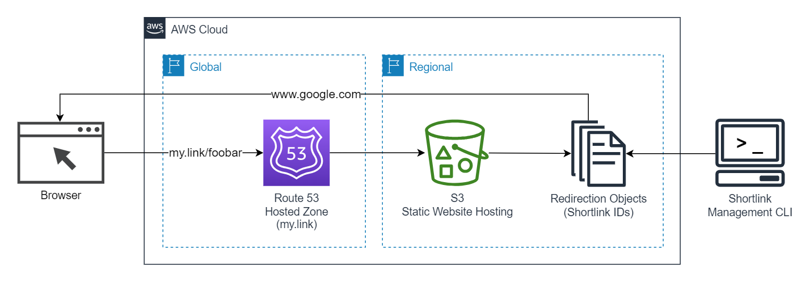

# AWS URL Shortener

[](https://github.com/StevenJDH/AWS-URL-Shortener/actions/workflows/terraform-tflint-workflow.yml)


[](https://app.codacy.com/gh/StevenJDH/AWS-URL-Shortener/dashboard?utm_source=gh&utm_medium=referral&utm_content=&utm_campaign=Badge_grade)
[](https://sonarcloud.io/summary/new_code?id=StevenJDH_AWS-URL-Shortener)
[](https://sonarcloud.io/summary/new_code?id=StevenJDH_AWS-URL-Shortener)
[](https://sonarcloud.io/summary/new_code?id=StevenJDH_AWS-URL-Shortener)
[](https://sonarcloud.io/summary/new_code?id=StevenJDH_AWS-URL-Shortener)
[](https://sonarcloud.io/dashboard?id=StevenJDH_AWS-URL-Shortener)
[](https://sonarcloud.io/summary/new_code?id=StevenJDH_AWS-URL-Shortener)
[](https://sonarcloud.io/summary/new_code?id=StevenJDH_AWS-URL-Shortener)
[](https://sonarcloud.io/summary/new_code?id=StevenJDH_AWS-URL-Shortener)


AWS URL Shortener is a project that shows how to create a [Vanity URL Shortening Service](https://www.seobility.net/en/wiki/Vanity_URL) using just AWS S3 Static Website Hosting and Route 53. This approach is fully serverless and does not require any coding. Platform specific CLI scripts (AWS CLI wrappers) are provided to make managing the shortlinks easier. The service works by using a little known feature in S3 called Object Redirection, which consists of setting some system-defined metadata on an empty object to redirect requests to a website configured as the target destination. Since these objects hold 0 bytes, the overall cost for this project is near 0 per month excluding the already low cost of a hosted zone in Route 53.



[](https://www.buymeacoffee.com/stevenjdh)

Releases: [https://github.com/StevenJDH/AWS-URL-Shortener/releases](https://github.com/StevenJDH/AWS-URL-Shortener/releases)

## Features
* Fully manage all shortlinks with simple to remember commands.
* Use human readable names for shortlinks instead of random characters.
* Create permanent and temporary shortlinks to suite different needs.
* Unlimited shortlinks with no need to set up redirection rules.
* Powered by native S3 features that remove the need for a databases.
* Link previews for destination URLs in apps like Whatsapp.
* Support for Windows, Linux, and macOS.
* Terraform project to quickly set up the backend for all of this.

## Prerequisites
* [AWS CLI 2.7.x](https://aws.amazon.com/cli) or newer installed.
* [Domain registered](https://docs.aws.amazon.com/Route53/latest/DeveloperGuide/domain-register.html) in Route 53.
* [Terraform 1.30.x](https://developer.hashicorp.com/terraform/downloads?product_intent=terraform) or newer installed.
* Sufficient permissions in AWS to run everything.

## Deploying the backend via Terraform
Included is a Terraform project for Infrastructure as Code (IaC) to quickly create a working backend environment. It mainly creates some S3 buckets with test files and the needed DNS records to make this work with the selected domain. To begin, perform the following steps:

1. Change to the `Terraform` directory, and initialize the project:
   
   ```bash
   terraform init
   ```

2. Create a plan to see what AWS resources will be created:

   ```bash
   terraform plan -var domain=my.link -out backend.tfplan
   ```

3. Create the resources based on the plan:

   ```bash
   terraform apply "backend.tfplan"
   ```

4. To remove the backend, run destroy using the same variable as before:

   ```bash
   terraform destroy -var domain=my.link
   ```

The `domain` variable controls what domain will be used for the vanity URL shortening service. In other words, make sure to replace `my.link` with the needed one.

To test if the backend is set up correctly, open a browser, and enter the configured domain, like `my.link`. A welcome page should appear if it works. Next, test if shortlinks are being redirected by navigating to `<your-domain>/test`. If this redirects to google.com, then the setup is working. Finally, perform the same tests by adding the `www` subdomain to everything to ensure the same results.

## CLI script installation
Extract the CLI script that is compatible with the operating system it will run on, and place it into a folder. Add the folder location where the script is installed to the system PATH. After, type `setx AWS_URL_SHORTENER my.link` for Windows, or `export AWS_URL_SHORTENER=my.link` for Linux and macOS, to tell the CLI script what Domain/S3 Bucket to use for the shortlinks. For Windows, the console may need to be restarted for the changes to take effect, and for Linux and macOS, run `chmod +x shortlink` to add the execution bit if needed. Finally, type `shortlink version` to confirm the CLI script is working.

## Command line usage
Below is the usage information that is needed to manage the shortlinks via the command line.

    Usage: shortlink OPERATION shortlink_id destination_url [expires]

    Options:
      create     Creates or updates a shortlink using both required parameters.
      remove     Removes an existing shortlink using first parameter only.
      list       Lists the existing shortlinks.
      describe   Describes a shortlink's configuration.
      version    Displays the version of the script.
    
    Examples:
      shortlink create foobar https://www.google.com
      shortlink create foobar https://www.google.com expires
      shortlink describe foobar
      shortlink remove foobar

The following shows a sample output when describing an existing shortlink called `github`:

```text
> shortlink describe github

------------------------------------------------------
|                     HeadObject                     |
+-------------------+--------------------------------+
|     Property      |             Value              |
+-------------------+--------------------------------+
|  Shortlink        |  my.link/github                |
|  Destination      |  https://github.com/StevenJDH  |
|  Expiration       |  Never                         |
|  UTCLastModified  |  2023-08-19T20:47:48+00:00     |
+-------------------+--------------------------------+

Operation completed successfully.
```

> 📝**NOTE:** All files and folders not related to shortlinks will be ignored by the CLI script. This was done so that a static website can also be hosted in the same bucket as the shortlinks to extend support for a UI, or to allow for any other need.

## Disclaimer
AWS URL Shortener is distributed in the hope that it will be useful, but WITHOUT ANY WARRANTY; without even the implied warranty of MERCHANTABILITY or FITNESS FOR A PARTICULAR PURPOSE. See the GNU General Public License for more details.

## Contributing
Thanks for your interest in contributing! There are many ways to contribute to this project. Get started [here](https://github.com/StevenJDH/.github/blob/main/docs/CONTRIBUTING.md).

## Do you have any questions?
Many commonly asked questions are answered in the FAQ:
[https://github.com/StevenJDH/AWS-URL-Shortener/wiki/FAQ](https://github.com/StevenJDH/AWS-URL-Shortener/wiki/FAQ)

## Want to show your support?

|Method          | Address                                                                                   |
|---------------:|:------------------------------------------------------------------------------------------|
|PayPal:         | [https://www.paypal.me/stevenjdh](https://www.paypal.me/stevenjdh "Steven's Paypal Page") |
|Cryptocurrency: | [Supported options](https://github.com/StevenJDH/StevenJDH/wiki/Donate-Cryptocurrency)    |


// Steven Jenkins De Haro ("StevenJDH" on GitHub)
